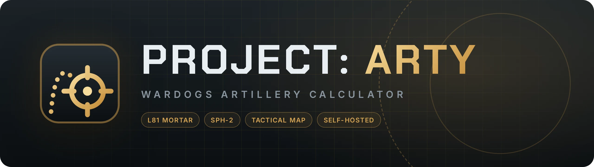
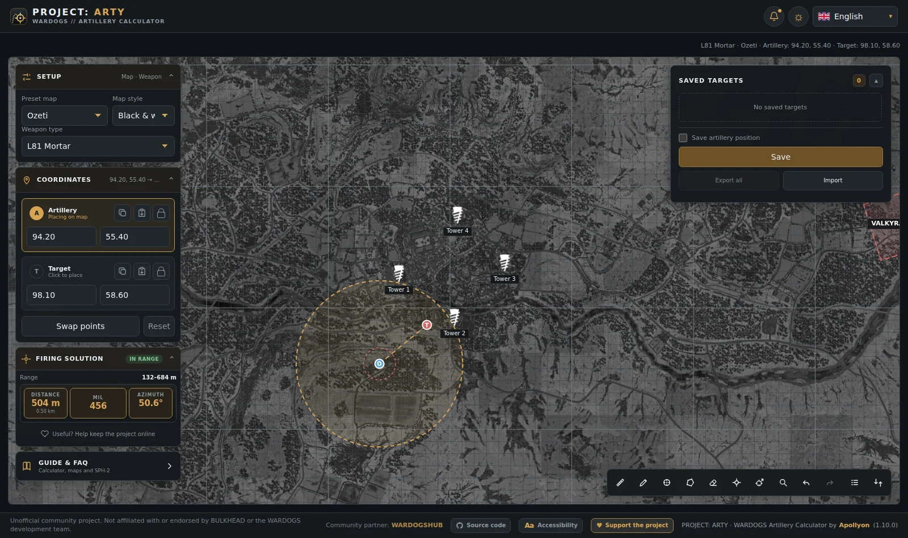
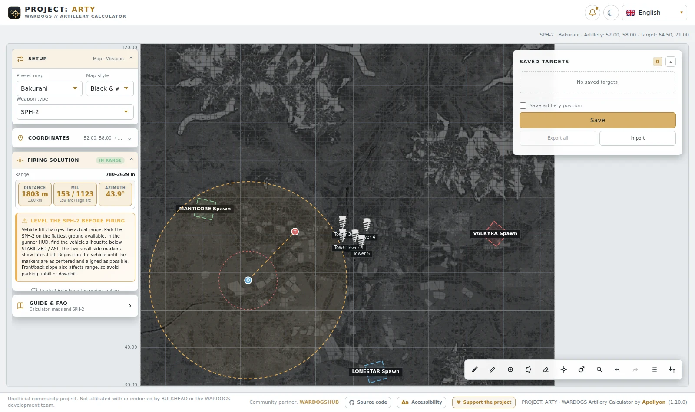
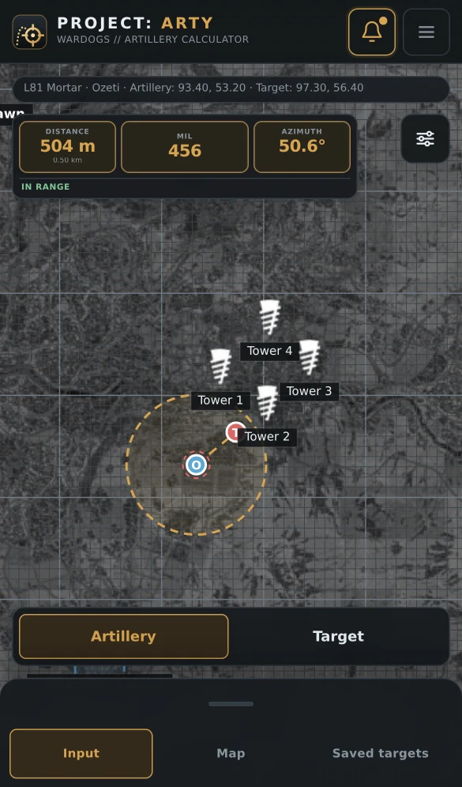

<p align="center">
  
</p>

<p align="center">
  <a href="https://github.com/scopeddlol/project-arty/actions/workflows/docker.yml"></a>
  <a href="https://github.com/scopeddlol/project-arty/pkgs/container/project-arty"></a>
  <a href="LICENSE"></a>
</p>

<p align="center">
  <b>A self-hosted L81 Mortar and SPH-2 artillery calculator and tactical map for WARDOGS.</b><br>
  One container. Any hostname. No accounts, no tracking.
</p>

<p align="center">
  
</p>

<table>
  <tr>
    <td width="70%"></td>
    <td width="30%"></td>
  </tr>
  <tr>
    <td align="center"><sub>Light theme · SPH-2 with low and high arc</sub></td>
    <td align="center"><sub>Mobile · touch-first map</sub></td>
  </tr>
</table>

## Quick start

```bash
curl -O https://raw.githubusercontent.com/scopeddlol/project-arty/main/docker-compose.yml
mkdir map-assets
docker compose up -d
```

Open **http://localhost:8080**. Phones are sent to the mobile interface
automatically.

> **Bring your own map assets.** Map imagery and Terrain3D data are not
> included. Put your own, legally obtained tiles in `map-assets/` and restart;
> see [Map assets](docs/self-hosting.md#map-assets) for the layout. Without
> them everything works, but the map background is blank.

Update with `docker compose pull && docker compose up -d`.

## Features

- **Firing solutions:** distance, azimuth and MIL for the L81 Mortar
  (132–684 m) and SPH-2 (780–2629 m, low and high arc), with in-range status.
- **Calibrated maps:** Bakurani, Ozeti and Zestafona use in-game coordinates,
  spawns, markers and contour overlays.
- **Terrain3D:** elevation lookup and ΔZ context for the SPH-2.
- **Map Tools:** ruler, pencil, zones, polygons, markers, coordinate search,
  adjust-fire and layers. Undo/redo and JSON import/export are included.
- **Saved targets:** store, export and import target lists.
- **Desktop and mobile:** a full sidebar layout, plus a separate map-first
  touch UI with pinch zoom and a bottom sheet.
- **13 languages,** with light and dark themes and accessibility settings.
- **Self-host friendly:** one container that runs on any domain or LAN address,
  even over plain HTTP, and serves map assets from a folder you control.

## How it works

```text
Browser ──► nginx (container, :8080)
              ├── /                 static app (HTML, JS, CSS, JSON)
              ├── /maps/tiles/…     ┐
              └── /data/terrain/…   ┘ your map-assets folder (read-only mount)
```

The image runs as a non-root user on a read-only filesystem, with a health check
at `/healthz`. It contains no map imagery and makes no third-party requests.

## Development

```bash
npm run dev      # live-reloading dev server on http://localhost:8000
npm run check    # unit tests + production build + build verification
docker compose up -d --build   # build and run the container locally
```

Node.js 22+ is only needed for development; the project has no npm
dependencies. Pushes to `main` publish `ghcr.io/scopeddlol/project-arty:latest`,
and `v*` tags publish versioned images.

## Documentation

| Guide | Covers |
| --- | --- |
| [Self-hosting](docs/self-hosting.md) | Compose, configuration, updates, HTTPS, image publishing |
| [Development](docs/development.md) | Project structure, dev server, tests, build pipeline |
| [Features](docs/features.md) | Calculator, Map Tools, shortcuts, weapons, coordinate system |
| [Maps](docs/maps.md) | Map definitions, tiles, markers and adding a map |
| [Terrain](docs/terrain.md) | Terrain3D data, SPH-2 leveling and validation |
| [Mobile](docs/mobile.md) | Mobile routes, touch controls and QA viewports |
| [Localization](docs/localization.md) | Languages, localized routes and translations |
| [Message of the Day](docs/motd.md) | In-app announcement configuration |

## Contributing

Corrections and improvements are welcome: map calibration, markers, weapon
data, translations, bug fixes and UI polish. Edit sources under `src/pages/`,
`js/`, `styles/` and `locales/` (never `dist/`), run `npm run check`, and open a
pull request.

## Credits and license

PROJECT: ARTY is based on the
[WARDOGS Artillery Calculator](https://github.com/apollyon-sys/wardogs-calculator)
by **Apollyon**. This fork does not use, proxy or redistribute that project's
hosted map and terrain assets.

The original source code is released under the [MIT License](LICENSE). WARDOGS
game assets, map imagery, names, logos and trademarks are **not** covered by the
MIT License and remain the property of their respective owners.

> **Unofficial fan project.** PROJECT: ARTY is not affiliated with, endorsed by
> or officially associated with **BULKHEAD** or the **WARDOGS** development team.
